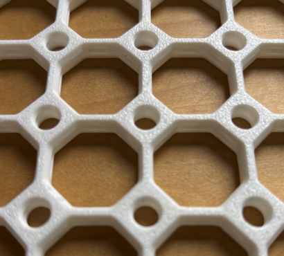

# Tiles <!-- omit from toc -->

The Multiboard tiles form the foundation of the system, providing a versatile base for various applications. Each [tile](https://than.gs/m/974378) is 25mm in size and is designed with threaded holes, allowing for secure connections and modularity.

## Table of Contents <!-- omit from toc -->

- [Features](#features)
- [Connection Methods](#connection-methods)
- [Applications](#applications)
- [Types](#types)
  - [Core Tiles](#core-tiles)
  - [Side Tiles](#side-tiles)
  - [Corner Tiles](#corner-tiles)
- [Mounting](#mounting)
  - [Screws](#screws)
    - [Screw-on mounts](#screw-on-mounts)
    - [Direct](#direct)
    - [Reconmended Screws](#reconmended-screws)
  - [Adhesive](#adhesive)
- [Model Links](#model-links)
  - [Models](#models)
  - [Generators](#generators)

## Features

- **Threaded Design**: Each tile is threaded, enabling the use of threaded connectors such as [Multiconnect](https://makerworld.com/en/collections/3718428-multiconnect-base-models) or bolts.
- **Diamond Connectors**: Between every four tiles, there is a diamond-shaped area with a threaded hole in the center. This allows for additional connection options, such as pass-through connectors or bolts.
- **Symmetry**: Tiles are symmetrical on both sides, making them easy to use and assemble in any orientation.
- **Stackable Printing**: Multiple tiles can be printed on top of each other to save time during manufacturing.

## Connection Methods

Tiles support four primary connection methods:

1. **Tiles**:
   - **Push Connectors**: Rely on pressure and friction to stay in place.
   - **Threaded Connectors**: Utilize the threads for secure attachment, such as [Multiconnect](https://makerworld.com/en/collections/3718428-multiconnect-base-models).

2. **Diamonds**:
   - **Pass-Through Connectors**: Similar to those found in pegboards, allowing for flexible configurations.
   - **Threaded Connectors**: Use bolts or other threaded components for a strong hold.

## Applications

- **Base Structure**: Tiles form the base where you can screw in threads, insert snaps, or use pegboard-style holes.
- **Surface and Shelving**: Tiles can act as the surface or supporting brackets for shelves.
- **Modular Assembly**: Their symmetrical design and stackable printing make them ideal for creating modular and scalable structures.

The Multiboard tiles are a versatile and essential component of the system, enabling endless possibilities for customization and functionality.

## Types

### Core Tiles

Core Tiles have two sides with pegboard holes, making them ideal for the central sections of a Multiboard wall.

### Side Tiles

Side Tiles feature one side with pegboard holes, designed for the edges of a Multiboard wall.

### Corner Tiles

Corner Tiles have no pegboard holes on any side, perfect for the corners of a Multiboard wall.

## Mounting

Tile can be attached to surfaces using the following methods

### Screws

There are two methods to attach tiles to the wall: screw-on mounts and directly to the surface

#### Screw-on mounts

These [components](https://www.multiboard.io/parts-library/mounting-systems), typically known as "snaps", attach to the substrate using one or more screws. The boards is then pushed into place. Usually a Quad-Offset-Snap is used to mount 4 tiles simultaneously (at their corners). Single and dual snaps are used to mount the border tiles.

#### Direct

Using screws, directly to the substrate. Screws are driven in the diamond holes to attach a board to the surface. A tile will require one screw in each corner.

To better control the placement of screws, you can use [overlapping multiboard tiles](
https://makerworld.com/en/models/749339). These tiles can be mechanically connected together using small bolts (through
the diamond threads) to create a single tile. You can connect this single tile to the wall where necessary, depending on the characteristics of the surface and/or the expected weight load.

#### Reconmended Screws

- M6
- 3.5mm
- #8-32

### Adhesive

Command Strips or VHB/Nano tape can be use with mounts designed for adhesives. Examples of these mounts are [Single Snap (DS Part A) - Small Command Strip Mount](https://than.gs/m/1112072) and [Single Snap (DS Part A) - Medium VHB Tape Mount](https://than.gs/m/1060994)

## Model Links

### Models

- [Multiboard Tile library](https://www.multiboard.io/parts-library/tiles)

### Generators

- [Free Multiboard Tile Generator](https://gridfinity.perplexinglabs.com/pr/multiboard/0/0)