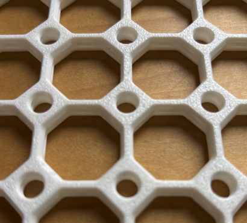

# Multiboard and Underware FAQs and other documentation

## What is Multiboard?

Multiboard is an organization system that can be 3d-printed.
See https://www.multiboard.io

## What is the license of multiboard?

You can find the multiboard license here: https://docs.google.com/document/d/1C0-Iyxydqk_d2I3o_5ualJ9Ywt9gwVdl9eukvC8JeKA/edit?tab=t.0

According to the Multiboard creators (see https://www.multiboard.io/license) you are given the rights to:

- use 3d-designs for personal use (non-commercial)
  - if you want to sell Multiboard products (and your derivatives) you must seek
    a commercial license

- Remix non-trivial designs as long as:
  - they are not trivial
  - they are distributed under the Multiboard license (original license)
  - give appropriate credit including linking to their website and license
  - you implicitly give a full license to the Multiboard creators

## Is multiboard free?

For the majority of use-cases downloading and 3d-printing multiboard components is free.

While you can subscribe to their Memberships (see https://www.multiboard.io/support) it is not necessary.

## What are the main components of multiboard?

The main components of multiboard are:

1. Panels. Base panels (boards) that were originally meant to be placed vertically (and secured against a wall).  They
   can also be used horizontally (e.g. under a desk, see Underware below).

2. Accessories to attach to the wall.
  - Shelves,
  - Hooks,
  - etc.

3. Storage containers
  - these can be used stand alone or can be attach to the panels

## What makes multiboard panels special?

A multiboard board is composed of a grid of tiles.  Each tile is 25mm in size. See
   https://thangs.com/designer/Multiboard/3d-model/6x6%2520Multiboard%2520Core%2520Tile-974378

Each tile is threaded. In between 4 tiles there is a diamond with a threaded hole in the middle.

Attachments can connect to Multiboard in four different ways:

- tiles:
  - push connectors (they rely on pressure and friction to stay in place)
  - threaded connectors (such as [Multiconnect](https://makerworld.com/en/collections/3718428-multiconnect-base-models)) that take advantage of the threads

- diamonds:
  - pass through connectors (similar to those found in pegboards)
  - threaded connectors, such as bolts.

## How do I attach the panels to the substrate (wall or desk)?

There are two methods to attach panels to the wall: screw-on mounts, and directly to the substrate

- Screw-on mounts (see https://www.multiboard.io/parts-library/mounting-systems)
  These components, typically known as "snaps", attach to the substrate using one or more screws. The boards is then pushed into place. Usually a Quad-Offset-Snap is used 
  to mount 4 panels simultaneously (at their corners). Single and dual snaps are used to mount the border panels.
  
- Using screws, directly to the substrate. Screws are driven in the diamond holes to attach a board to the substrate.  A
  panel will require one screw in each corner.
  
To better control the placement of screws, you can use overlapping multiboard (see
https://makerworld.com/en/models/749339). These panels can be mechanically connected together using small bolts (through
the diamond threads) to create a single board. You can connect this single panel to the wall where
necessary, depending on the characteristics of the substrate and/or the expected weight load.

## I want to screw directly to the wall, any recommendations? 

It is best to use screws with a conic head. That way the screws do not obstruct any attachments. Make sure that the head
has a maximum diameter above 6mm.  M3.5 screws are the minimum size you can use. To make sure the panels remain aligned,
I recommend you use a pilot hole ([this is a handy pilot hole guide](https://makerworld.com/en/models/1091343)).  You
can also use these [bolts](https://makerworld.com/en/models/1092547) and an extra panel to make sure the panel you are
attaching is align with previously connected ones (or to skip an area where you cannot cover with a panel).

## What is Multiconnect?

Multiconnect is a generic connector system that can be used to attach several models to your multiboard panel. It is not specific to multiboard, but
can be used with other systems like HSW, GOEWS, Idea Skadis and openGrid as well. This makes multiconnect very versatile and allows you to use the
same accessories on different systems.

Multiconnect also provides modeling files to be used when creating your own accessories.

See:
* [Standard multiconnect](https://makerworld.com/en/models/790825-multiconnect-generic-connector-for-multiboard-v2)
* [Flush multiconnect](https://makerworld.com/en/models/1026736-flush-multiconnect-generic-multiboard-connector) (perfect match for Underware, see below)
* [Modeling files](https://makerworld.com/en/models/645768-multiconnect-v2-modeling-files)
* [Full set of multiconnect files](https://makerworld.com/en/collections/3718428-multiconnect-base-models) (also for other boards)

You may also find many [models compatible to multiconnect on makerworld](https://makerworld.com/en/search/models?keyword=multiconnect) and
[printables](https://www.printables.com/search/models?ctx=models&q=tag:multiconnect).

## What is Underware?

Underware is a system created by HandsOnKatie (https://handsonkatie.com/) with the goal of managing cables and other accessories under a desk.
Underware can use multiboard panels as a substrate but it can also use OpenGrid panels.

See https://handsonkatie.com/underware-2-0-the-made-to-measure-collection/

For an introduction to Underware see: https://www.youtube.com/watch?v=0TT96b98YZY&pp=0gcJCU8JAYcqIYzv
